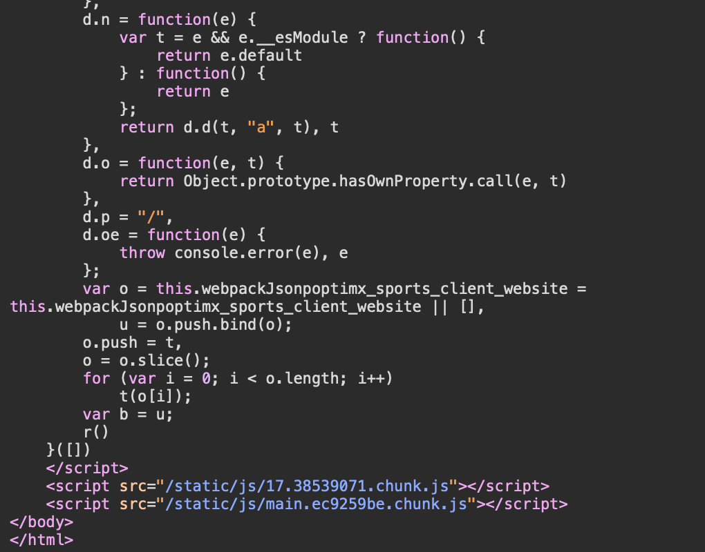

# Website Assessment for Illinois Rugby FC

## Website Overview
- **Website**: [Illinois Rugby FC](https://www.illinoisrugbyfc.com)

## Web Technologies
 From inspection, the website uses HTML for structure, CSS for styling, and JavaScript to manage interactive elements. In the browser’s developer tools, you can find HTML files responsible for the page layout and content, CSS files for the design and appearance, and JavaScript files for dynamic behavior like event handling.
- HTML files: Main Page,widget_iframe.2f70fb173b9000da126c79afe2098f02.html
- CSS files: cpy2ahk.css and so on
- JavaScript files: sdk.js, recaptcha__en.js, and so on
- Other files: png files, woff2 files, php files

## Website Developers
From the investigation:
- Developer information was not found directly.
- Based on the image, the website seems to have been built by optimx_sports and Illinois Men's Rugby Club member is maintaining it.

## GitHub Repository
- The GitHub repository for the website is not found.
